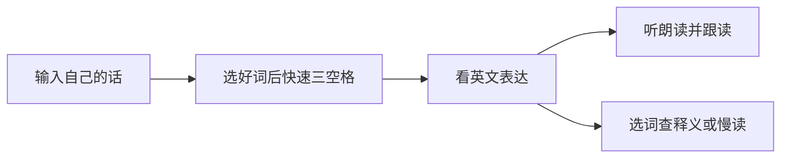

  

# Mansur 输入法

**让每一次输入，成为英语练习。**

正常输入中文或英文，选好词后快速按三次空格：提交本句、显示英文并朗读。
遇到不熟悉的英文，可以在浮窗内选词查释义、听慢读，或复制后自行使用。

**Windows · Alpha 源码 · MIT · 作者：Mansur**

[快速开始](docs/QUICK_START.md) · [图文使用手册](docs/USER_GUIDE.md) ·
[常见问题](docs/FAQ.md) · [English](README.en.md)

## 为什么做这个输入法

聊天、记事和日常打字，本来就在表达自己的想法。Mansur 把这些已经熟悉的
内容变成英文表达，让你知道“这句话用英语怎么说”，然后听一遍、跟读一遍。
练习来自你刚刚说的话，容易理解，也容易记住。

## 项目海报

  

[查看海报原图](docs/media/mansur-poster.png)。这张海报为项目宣传示意；具体操作
以当前使用手册为准。当前公开交付是 Alpha 源码，尚无独立电脑验收后的安装包。

## 三步体验

### 1. 正常打字、选择候选

使用全拼或简拼输入，空格选首项、数字选词；候选支持翻页。
轻按 Shift 可以切换英文模式，保留 `Hello`、`mansur` 等原文。

### 2. 快速三空格，听自己的英文表达

选好词后再快速按三次空格，确认并学习。中文翻译为英文；英文保留原文并朗读。
浮窗中的英文可以拖选、复制，也可以重播。

### 3. 选中不熟悉的词，查释义、慢读

在本产品的英文浮窗内选词或短语，主动点击查询或朗读。
查询结合当前句子；“慢读”帮助你听清所选内容。释义是模型参考结果。

以上界面使用生产控件和固定演示内容，其中部分通过离屏渲染生成，
不代表真实 API 请求录像。图片来源及许可见[素材说明](docs/media/README.md)。

## 已有功能

| 功能 | 说明 |
| --- | --- |
| 中文输入 | 自主开发的输入核心；全拼、简拼/混拼、可选模糊音、九项候选与翻页 |
| 中英切换 | 轻按 Shift；英文原文、大小写正常保留 |
| 英语学习 | 快速三空格确认本句，中文翻译、英文显示和朗读 |
| 选词学习 | 在已有英文浮窗内显式查释义、朗读或慢读所选内容 |
| 复制与重播 | 复制整句或选中内容；重播已有句子 |
| 个人词库 | 已确认短词的使用记忆；支持导入、导出与关闭自动记词 |
| 外观 | 浅色、深色、跟随系统；横向/纵向候选；字体大小；可隐藏状态栏 |
| 模型与 API | 翻译、朗读分别配置本地或 API；按服务加密保存密钥 |

翻译预设包括 DeepSeek、千问、智谱 GLM、Kimi、豆包、MiniMax、腾讯 TokenHub、
混元、百度千帆、阶跃星辰、讯飞星火，以及 OpenRouter、OpenAI、硅基流动和
自定义兼容入口。朗读支持本地 Kokoro 及已实现的兼容接口，包括阶跃星辰。
语言模型入口不表示同厂所有原生语音协议均已实现。见[厂家配置](docs/DOMESTIC_PROVIDERS.md)。

## 从哪里开始

**目前仓库提供源码。GitHub 的 Download ZIP 下载的是源码，不是安装包。**

| 你的情况 | 入口 |
| --- | --- |
| 首次了解或已有试用安装 | [快速开始](docs/QUICK_START.md) |
| 想了解全部操作 | [图文使用手册](docs/USER_GUIDE.md) |
| 想配置本地模型 | [模型下载链接、版本与校验值](docs/LOCAL_MODELS.md) |
| 想使用自己的 API | [厂家配置](docs/DOMESTIC_PROVIDERS.md) |
| 想从源码运行 | [构建说明](docs/BUILDING.md) |
| 遇到问题 | [FAQ](docs/FAQ.md)、[已知限制](docs/KNOWN_ISSUES.md)、[提交问题](https://github.com/mabin8121828-crypto/Mansur-IME/issues/new/choose) |
| 想参与开发 | [贡献说明](CONTRIBUTING.md)、[版本记录](CHANGELOG.md) |

独立电脑的安装、更新、卸载验收完成后，安装包将在
[Releases](https://github.com/mabin8121828-crypto/Mansur-IME/releases) 提供。
目标环境为 Windows 10/11 x64，同时构建面向 32 位应用的输入组件。
macOS、Linux、Windows ARM64 尚未完成实现或验收。

## 验证与当前边界

现有本地基线完成了 427 项桌面组件检查和 97 项 Python 检查。
仓库自动检查覆盖文档链接、素材校验、Python 检查、双架构原生构建和桌面组件构建。
这些检查不安装输入法、不调用真实账户、不下载大模型，也不等同于所有电脑、
应用和厂商的真实验收。详情见[已知限制与验证范围](docs/KNOWN_ISSUES.md)。

目前没有网页划词、麦克风评分或生词本；英文译文由用户复制、粘贴，
不自动写回编辑器或发送消息。

## 隐私与许可

- 只处理本输入法持有并确认的本句，不读取宿主全文或剪贴板历史。
- 个人短词记忆保存在本机，可关闭；不会作为上下文自动上传。
- API 模式会将明确确认的内容发送到你选择的服务，可能产生调用费用。
- 源码不附带开发者密钥、个人配置、模型权重或 Python 环境。

完整说明见[隐私说明](docs/PRIVACY.md)。

项目自有代码采用 [MIT](LICENSE)，允许商业使用、修改与再分发；
再分发时保留 `Copyright (c) 2026 Mansur` 及许可文本。
第三方词库、图标、模型和运行库分别遵守原有许可，见
[第三方说明](THIRD_PARTY_NOTICES.md)及[版权说明](COPYRIGHT.md)。
内部历史文件名中的 `MansurNext` 用于兼容已有注册与安装路径，公开品牌为 Mansur。
