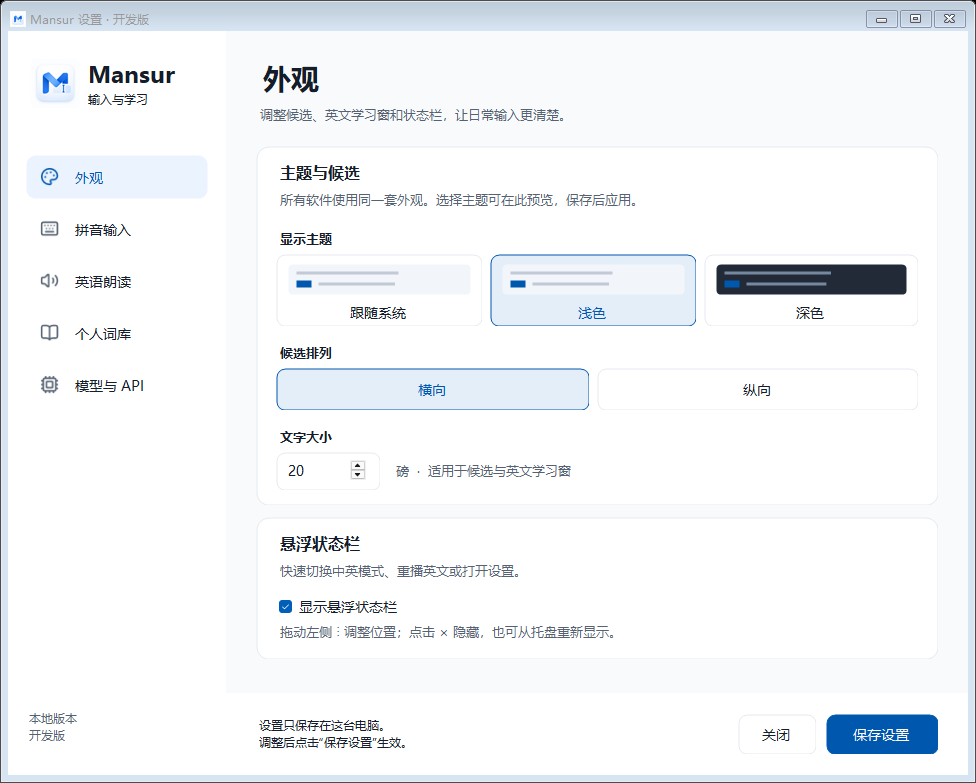
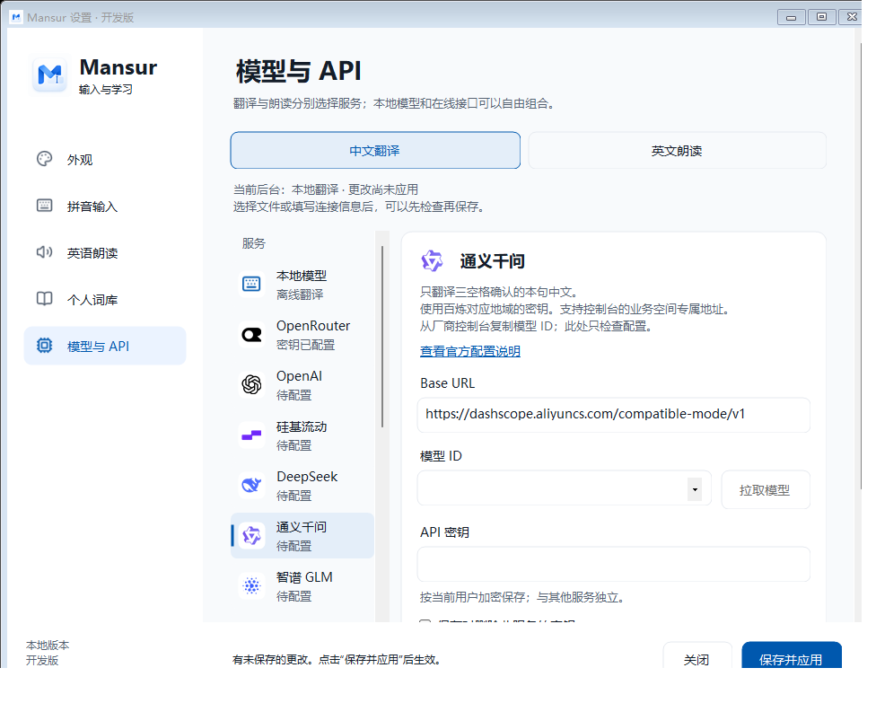

# 快速开始

[返回首页](../README.md) · [完整手册](USER_GUIDE.md) · [常见问题](FAQ.md)

## 先确认你拿到的是什么

| 内容 | 下一步 |
| --- | --- |
| GitHub 源码或 Download ZIP | 按[构建说明](BUILDING.md)准备开发环境；源码不能直接双击安装 |
| 已有完整试用安装 | 从下面“打开设置”开始 |
| 希望直接下载正式安装包 | 当前为 Alpha 源码阶段；独立电脑验收后在 [Releases](https://github.com/mabin8121828-crypto/Mansur-IME/releases) 发布 |

## 1. 打开设置

已有试用安装可通过桌面的 **Mansur 输入法设置** 快捷方式打开。
也可点击悬浮状态栏的齿轮，或右键托盘图标选择 **设置…**。

左侧包含外观、拼音输入、英语朗读、个人词库、模型与 API。
普通页面修改后点击 **保存设置**；模型页面点击 **保存并应用**。

## 2. 分别配置翻译和朗读

进入 **模型与 API**，上方的 **中文翻译** 和 **英文朗读** 分开选择服务。

| 选择 | 需要准备 |
| --- | --- |
| 翻译 API + 朗读 API | Python 运行程序；两项服务各自的地址、模型及凭证 |
| 翻译 API + 本地朗读 | Python、Kokoro 模型和依赖；翻译 API 凭证 |
| 本地翻译 + 本地朗读 | Python、Qwen GGUF、llama.cpp 运行组件、Kokoro 模型和依赖 |

API 模式填写厂家的 **Base URL、模型 ID、API 密钥**；朗读还需相应的音色和
输出格式。模型 ID 以厂家控制台为准。可滚动服务列表或添加自定义兼容服务。
**检查配置** 可能只完成本地字段检查，不代表真实账户已成功生成结果。

本地文件及运行环境的配置见[模型下载与配置](LOCAL_MODELS.md)；
不同厂家要求见[厂家配置](DOMESTIC_PROVIDERS.md)。源码没有附带模型或凭证。

## 3. 完成第一句

1. 使用 Windows 输入法切换入口或 Win + Space 选择 Mansur。
   已有历史安装的系统名称可能仍显示 Mansur Next。
2. 输入 `nihao`，按空格选出“你好”。
3. 选好词后，**再快速按三次空格**，提交本句、显示英文并朗读。

选择候选的那次空格不计入三空格学习；三次应是快速的独立按键，不能长按。
浮窗中的英文可以拖选后按 Ctrl + C，或点击复制图标复制整句。
译文由你自行粘贴，输入法不会自动发送消息。

## 4. 试一下英文和选词学习

轻按 Shift 切到英文模式，输入 `Hello`，再快速三空格。
英文保持原文，显示并朗读；人名也可以按英文原样输入。

在英文浮窗中拖选一个词，按 Ctrl + D 查释义，或 Ctrl + R 朗读。
也可使用窗口里的查询、朗读图标；勾选 **慢读** 后再朗读所选内容。

Enter 用于只提交、不学习：如果还有未选出的拼音，首次 Enter 将其作为原文
加入当前草稿；没有待选拼音时，Enter 提交当前整句。发送消息仍使用应用自己的操作。

声音、窗口或服务异常时，请先看[常见问题](FAQ.md)。截图为固定演示内容，
并非你的实际配置或所有厂家的云端验收结果。
