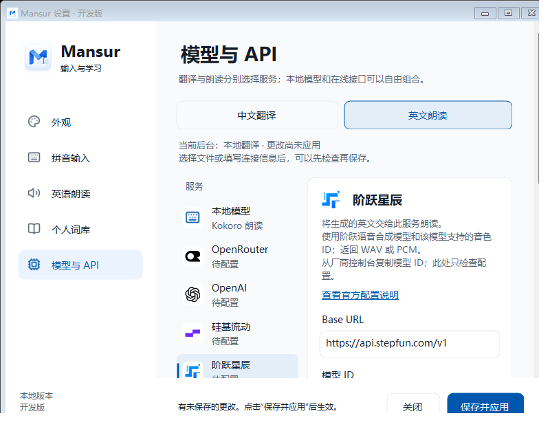

# Mansur 图文使用手册

[首页](../README.md) · [快速开始](QUICK_START.md) · [FAQ](FAQ.md)

## 1. 输入与学习是两步

候选窗口用于选字、组词和组成当前句子；英文浮窗显示确认后的学习内容。
**候选空格用于选词，选好词后快速三空格用于提交并学习。**

| 按键或操作 | 作用 |
| --- | --- |
| 空格 | 选择当前首项候选 |
| 1–9 或点击候选 | 选择对应候选 |
| -、= / +、Page Up、Page Down | 有待选候选时翻页 |
| Backspace | 删除当前输入中的字符 |
| Esc | 取消当前输入 |
| 轻按 Shift | 切换中文和英文模式 |
| 选好词后快速三空格 | 确认本句并学习 |
| Enter | 没有待选拼音时只提交本句，不学习；有待选拼音时先将其作为原文加入草稿 |

### 中文、简拼与模糊音

全拼是基础输入方式；简拼与混拼、模糊音可在 **拼音输入** 页配置。
简拼候选会与同样拼写的普通拼音竞争，不保证一个缩写只对应一条固定短语。
常用字词选择、个人使用次数和词频共同影响排序。

### 英文与混合输入

轻按 Shift 切到英文模式，输入 `Hello`、`mansur` 或其他英文，大小写与正文保留。
快速三空格可以学习英文原文；中文确认句会生成英文，纯英文不会被强制转换为汉字。
Shift 组合快捷键与单独轻按 Shift 有区别。

本句来自输入法当前持有的内容，不读取编辑器中旧有的全文。
三次空格需要快速分别按下；长按空格不等同于三空格操作。

## 2. 英文浮窗：看、听、复制

例如输入“我到家以后给你打电话。”，可能得到：

> I'll call you once I get home.

翻译措辞随模型而变化，下面仅为固定示例。

| 操作 | 作用 |
| --- | --- |
| 重播图标 | 重播已有本句音频 |
| 复制图标 | 复制整句纯文本 |
| 拖选后 Ctrl + C / Ctrl + Insert | 复制所选内容 |
| Ctrl + A | 选中整句 |
| 右键菜单 | 复制等文字操作 |
| × 或 Esc | 关闭浮窗；有选词卡片时 Esc 先关闭卡片 |

浮窗显示时不自动抢走输入焦点；主动点击英文后才进入文字选择操作。
播放完成后约三秒收起，鼠标悬停或选择期间保留。关闭可停止当前播放。
新确认句会替换旧请求；托盘 **重播本句** 可再次查看和听本句。

英文复制后由你自行粘贴到应用。没有自动替换中文、追加译文或发送消息的功能。

### 音色与速度

本地朗读提供 Heart、Bella、Michael、Emma；在 **英语朗读** 页选择音色和速度。
API 音色在对应服务中填写，以厂家的音色 ID 为准。
**朗读失败时使用 Windows 英语声音** 为显式可选项，默认关闭，并且需要系统安装
可用英语声音；未启用时不会静默切换服务。

## 3. 在英文浮窗内选词学习

1. 在已有英文中选中单词、短语或一段内容。
2. 点击查询图标或按 Ctrl + D，查询结合当前句子的释义。
3. 点击朗读图标或按 Ctrl + R，朗读所选内容。
4. 希望更慢时先勾选 **慢读**，再触发朗读。

**选择本身不调用模型**，查询和朗读由你明确触发。
释义属于模型参考，专有名词可能存在不同解释，音标也可能缺失。
此功能只处理 Mansur 已有的英文，不读取网页选区或剪贴板历史。
当前没有麦克风评分和生词本。

## 4. 外观与状态栏

在 **外观** 页选择跟随系统、浅色或深色；候选可以横向或纵向排列，
字体大小可调整。修改后点击 **保存设置**。

悬浮状态栏提供中英切换、重播和设置入口。拖动左侧手柄调整位置；
点击 × 隐藏，可从托盘 **显示悬浮状态栏** 再次打开。

## 5. 个人词库

在 **个人词库** 页可以导入、导出；**记住常用字词** 控制自动记词。
记录的是已确认短词、拼音及使用次数，保存在本机，不保存整句输入历史。
关闭自动记词会停止新记录，不会自动删除已有词库。

连续选字的自动拼接限制在四字内，避免把偶然输入的一整句话变成高权重联想。
长词需要匹配其完整拼音或简拼后才可作为候选，使用次数不会让所有补全强行置顶。

支持 TSV 和 Rime 格式导入。TSV 示例见[词库示例](lexicon-example.tsv)：字段使用
真正的 Tab 分隔，不是字面上的 `\t`。单文件上限 4 MiB、10,000 条；Rime
外部包含词库不会自动递归导入。导出内容只包含个人词条。
导入后先完成当前输入，再切走并切回输入法，让当前上下文重新加载词库。

## 6. 模型与 API

### 分别配置中文翻译和英文朗读

上方切换 **中文翻译** 和 **英文朗读**，每项单独选择本地或 API 服务。
不同厂家可以组合使用；翻译服务的成功不代表朗读服务也已配置成功。

API 填写 **Base URL、模型 ID、API 密钥**。朗读服务还需正确的音色和输出格式。
可添加自定义兼容服务；**拉取模型** 仅适用于实现了对应模型列表接口的服务。
**检查配置** 有本地验证和网络检查的不同范围，不能把字段有效视为真实调用成功。

密钥按当前 Windows 用户加密保存。已经保存后，输入框可能留空并显示已保存状态；
留空保留已有凭证，填写新值才替换，移除凭证使用相应移除选项。
请勿把密钥、个人配置或含凭证的截图提交到 GitHub。

本地模式从 **运行环境** 配置 Python、翻译 GGUF、llama-server 和朗读模型目录。
完整下载说明见[本地模型](LOCAL_MODELS.md)，厂家差异见[厂家配置](DOMESTIC_PROVIDERS.md)。
模型页点击 **保存并应用** 后应用配置。

### 启动学习后台

已有完整试用包可运行 **启动英文伴读.cmd**。
也可在 **英语朗读** 页启用 **登录 Windows 后启动英文伴读**，保存后生效；默认关闭。
托盘 **重启学习服务** 可以重启学习后台。学习服务失败不应阻断基本中英文输入。

## 7. 安装、更新和卸载

当前 GitHub 公开的是 Alpha 源码，没有经过独立电脑验收的安装包。
源码构建见[构建说明](BUILDING.md)，后续发行见
[Releases](https://github.com/mabin8121828-crypto/Mansur-IME/releases)。

已有试用包应**完整解压后**运行其中的安装或更新入口，不能从 ZIP 压缩预览中的
临时路径运行。原生输入组件更新后，按该版本说明执行一次统一的 Windows 重启，
使已经加载旧组件的应用退出；反复重启个别应用不能代替安装验收。

卸载前先按需要导出个人词库，使用试用包的 **退出试用安装.cmd**，
不要直接删除系统中已注册或仍被加载的 DLL。

## 图片说明与验证范围

本手册的截图使用生产控件、固定演示内容及自有测试窗口，部分为离屏渲染。
截图没有个人聊天记录、真实凭证或 API 调用结果；不能据此认定其他电脑或
全部厂家已通过验收。具体来源见[素材说明](media/README.md)，验证边界见
[已知限制](KNOWN_ISSUES.md)。
